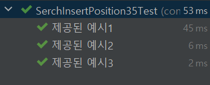
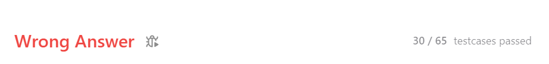
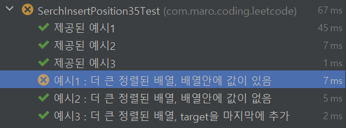
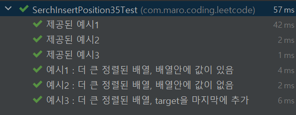

## 직접 짜는 알고리즘 테스트 케이스 두번째 고비
### leetcode 35번 내 테스트는 통과됐는데!!
내가 짠 테스트 케이스는 잘 통과가 됐다.

물론 주어진 예시만 테스트 케이스로 주었다.

실제로 코드를 제출해보니 리트코드에서 65개의 테스트가 있었고 그중 30개만 통과가 됐다.

너무 멍청하게 아무생각 안하고 이진탐색트리당! 헤헤 하면서 풀어서 그랬을까..

일단 문제를 해결하기 위한 방법을 생각해봤다.

음..🧐

일단 조건에 맞는 더 큰 인풋 값과 다양한 타겟을 설정해서 내 테스트에서도 틀리는 예제를 만들어 보기로 했다.

>예시1 : 더 큰 정렬된 배열, 배열안에 값이 있음
> 
>예시2 : 더 큰 정렬된 배열, 배열안에 값이 없음
> 
>예시3 : 더 큰 정렬된 배열, target을 마지막에 추가

를 추가해서 다시 테스트를 돌렸다.

 

배열이 더 큰 상태에서 배열안의 값이 있는경우 테스트를 통과하지 못했다.

코드를 살펴 보니 주어진 target 값보다 작거나 같은 인덱스를 찾고나서 인덱스를 리턴해줄때

+1해서 전달했는데, 이 경우는 배열안에 값이 없을때 그 값이 들어가야할 인덱스를 뺄때는 유효하지만 

그냥 그 자체의 인덱스를 가져오는것은 처리가 안되어 있는 것을 발견했다.

예외처리만 해주고 다시 테스트

코드를 짜고 테스트케이스를 넣고 검증해 나가는 방식이 TDD는 아니지만

그냥 테스트 코드 자체를 왜 사용하는지 조금 알것같기도 하다.

일단 뇌 사용량이 줄어든 것같은 느낌이다.

   

   

   

