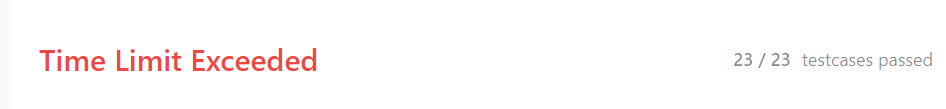
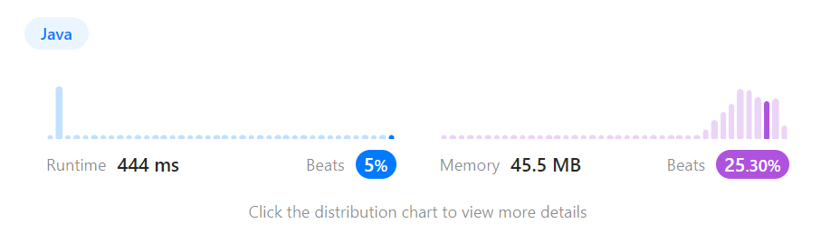
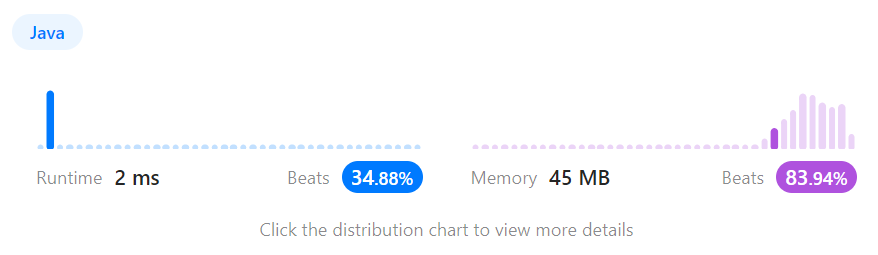
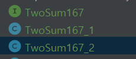

##  풀이
### 📖 JAVA

> Given a 1-indexed array of integers numbers that is already sorted in non-decreasing order, find two numbers such that they add up to a specific target number. 
> 
> Let these two numbers be numbers[index1] and numbers[index2] where 1 <= index1 < index2 <= numbers.length.

크기 순서대로 정렬된 1 차원의 정수배열이 들어온다. 

배열안의 2개의 숫자를 더하면 주어진 target 값이 되는 두개의 숫자를 찾아라.

배열의 인덱스가 보통 0부터 시작인데, 1부터 시작인 것처럼 생각해라.

<br>


> Return the indices of the two numbers, index1 and index2, added by one as an integer array [index1, index2] of length 2.

선택된 2개의 숫자를 길이가 2인 하나의 정수배열로 묶어서 리턴해라. 

<br>


> The tests are generated such that there is exactly one solution. 

테스트 케이스들은 정확히 하나의 정답만을 가지게 제시된다.

<br>


> You may not use the same element twice.

너는 한 값을 두번 쓸 수 없다.

<br>

> Your solution must use only constant extra space.

풀이는 고정된 공간만을 할당해서 풀수있다.

입력값에 의해 값이 동적으로 할당되는 방식을 사용하지 말 것.


<br>

>could you find an O(n) solution using a different approach?

빅오가 O(n)인 풀이를 찾아보실??

<br>

### 📖 풀이
[자바코드링크](https://github.com/RDDcat/Algorithm/blob/main/coding/src/main/java/com/maro/coding/leetcode/TwoSum167_1.java)

1번 코드 (제출은 됨..)



```java
public int[] twoSum(int[] numbers, int target) {
    int result[] = new int[2];
    for (int i=0; i < numbers.length; i++) {
        for(int j=i+1; j < numbers.length; j++ ){
            if(numbers[i] + numbers[j] == target ){
                result[0] = i + 1;
                result[1] = j + 1;
                return result;
            }
        }
    }

    return null;
}
```

2번 코드

[자바코드링크](https://github.com/RDDcat/Algorithm/blob/main/coding/src/main/java/com/maro/coding/leetcode/TwoSum167_2.java)

```java
public int[] twoSum(int[] numbers, int target) {
    int min = 0;
    int max = numbers.length - 1;

    for(int i=0; i<numbers.length;i++){
        if (numbers[min] + numbers[max] == target) {
            return new int[]{min + 1, max +1};
        } else if (numbers[min] + numbers[max] > target) {
            max--;
        } else {
            min++;
        }
    }
    return null;

}

```

### 📖 문제 풀이하면서 고민한 부분 1

일단 제출은 됐는데 


항상 처음 풀때는 멍청한 방법으로 풀어낸다.

그렇게 푸니 시간이 너무 밀려서 좀 고민해봤다.

two pointer 써서 풀면 빨라보여서 two pointer 로 풀이를 수정했다.

그러니 속도 개선이 된 모습!

나보다 더 빠른 녀석들은 어떻게 풀었나 봤는데. 

two pointer 에다가 바이너리 서치를 둬서 답을 찾으면 더 빨랐다.

흠...

### 📖 문제 풀이하면서 고민한 부분 2

이번에는 풀이가 너무 느려서 2번째 풀이를 짰는데 테스트 코드를 어떻게 돌려야할지 모르겠다.

지금은 


이런식으로 클래스를 나누고

테스트 에서는 

```java
private TwoSum167 twoSum167 = new TwoSum167_2();
```
```java
private TwoSum167 twoSum167 = new TwoSum167_2();
```

이런식으로 직접 바꿔주면서 테스트 한다.

불만이 있는데, 두개의 풀이를 항상 같은 테스트에 통과 시키고 싶은데 어떻게 해야하는지 모르겠다는 점이다.

흠...

<br>

<br>

<br>

<br>


